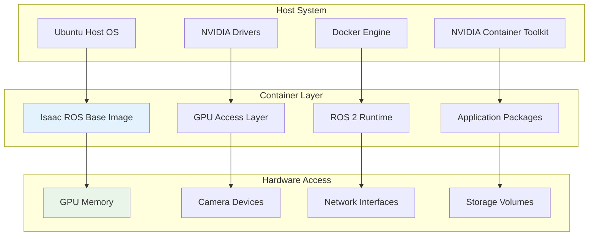
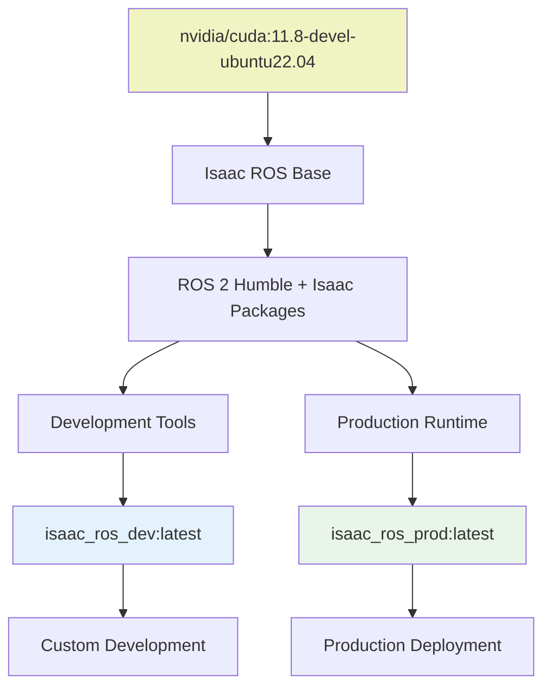
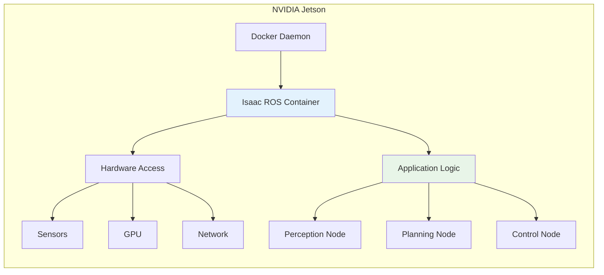
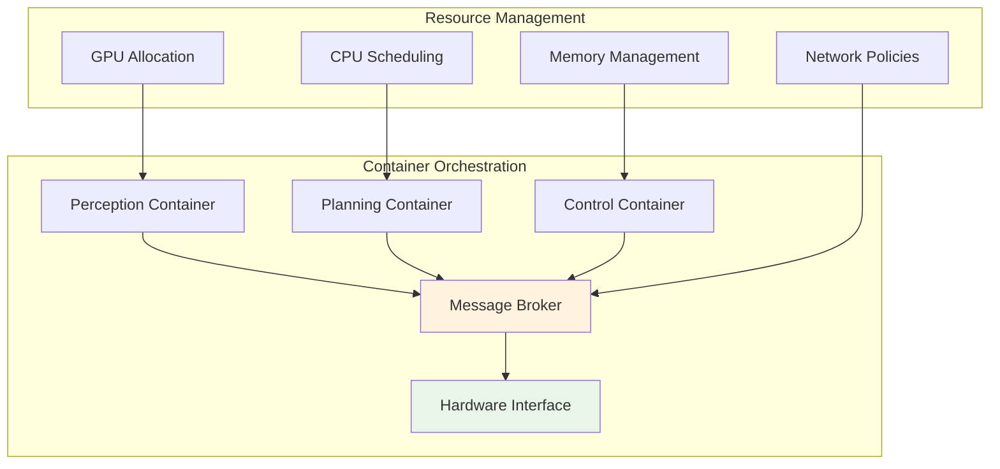
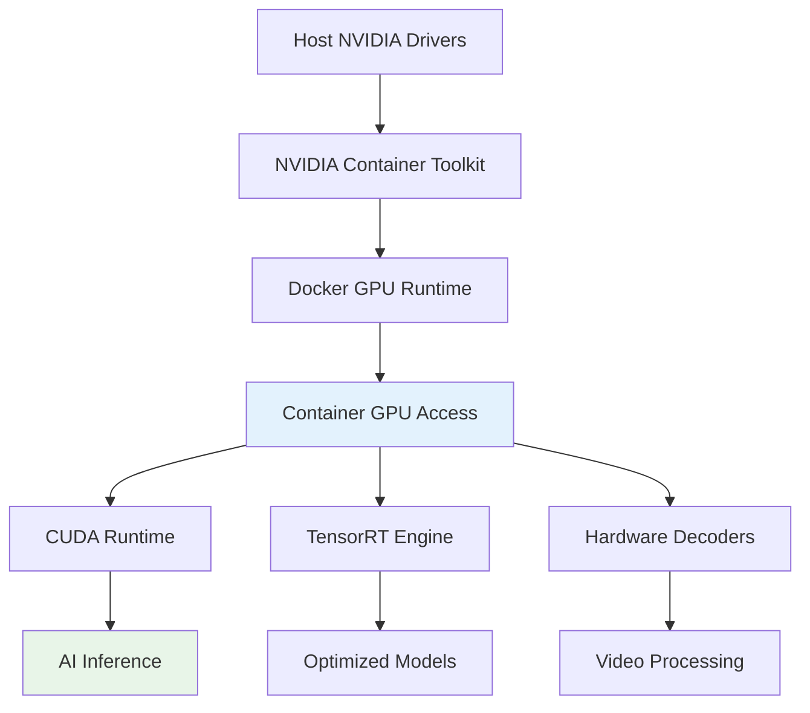
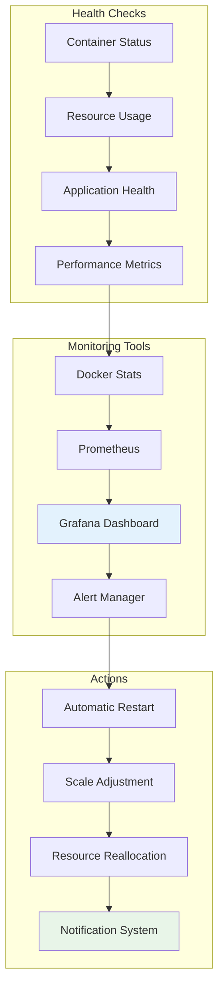
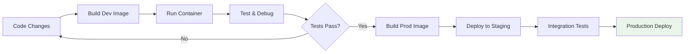
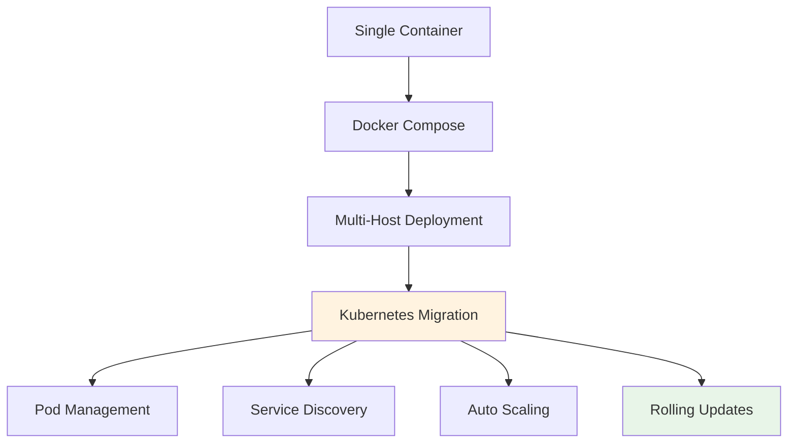

# 🐳 Docker Deployment Guide

  <h2>Containerized Isaac ROS Development & Production</h2>
  
<em>Consistent, scalable, and GPU-accelerated robotics applications</em>

---

## 🎯 Container Architecture Overview

The Isaac ROS Workspace leverages Docker containers to provide consistent development and deployment environments across different hardware platforms while maintaining optimal GPU acceleration performance.

### 🏗️ Architecture Design

### 🔑 Key Benefits

-   :material-consistency: **Environment Consistency**
    
    ---
    
    Identical runtime across development and production
    
    **Advantages:**
    
    - No "works on my machine" issues
    - Predictable behavior
    - Easy team collaboration

-   :material-gpu: **GPU Acceleration**
    
    ---
    
    Full NVIDIA GPU access with minimal overhead
    
    **Features:**
    
    - CUDA runtime support
    - TensorRT optimization
    - Hardware video decoding

-   :material-security: **Isolation & Security**
    
    ---
    
    Secure separation of applications and system
    
    **Benefits:**
    
    - Process isolation
    - Resource constraints
    - Clean dependency management

-   :material-rocket-launch: **Rapid Deployment**
    
    ---
    
    Fast startup and scaling capabilities
    
    **Capabilities:**
    
    - Quick container startup
    - Easy scaling
    - Version management

---

## 🛠️ Container Ecosystem

### Image Hierarchy

### Container Types

!!! info "Specialized Containers"
    
    === "🔧 Development Container"
    
        **Purpose:** Full development environment with debugging tools
        
        **Includes:**
        
        - Complete Isaac ROS workspace
        - Development tools (GDB, Valgrind)
        - Code editors and utilities
        - Interactive debugging support
        
        **Size:** ~8GB
        **Startup Time:** 10-15 seconds
    
    === "🚀 Production Container"
    
        **Purpose:** Optimized runtime for deployment
        
        **Includes:**
        
        - Minimal Isaac ROS runtime
        - Application-specific packages only
        - Optimized for performance
        - Reduced attack surface
        
        **Size:** ~3GB
        **Startup Time:** 3-5 seconds
    
    === "🎯 Application-Specific**
    
        **Purpose:** Specialized containers for specific robotics tasks
        
        **Examples:**
        
        - Perception-only container
        - Navigation-focused container
        - Manipulation controller
        - Multi-modal AI inference
        
        **Size:** 2-4GB (varies)
        **Startup Time:** 2-8 seconds

---

## 🚀 Deployment Strategies

### Single-Device Deployment

**Use Cases:**
- Development and testing
- Single-robot applications
- Edge computing scenarios
- Proof-of-concept deployments

### Multi-Container Architecture

**Advantages:**
- Better resource isolation
- Independent scaling
- Fault tolerance
- Easier maintenance

---

## 🔧 Configuration & Optimization

### GPU Access Configuration

!!! warning "Critical Configuration"
    
    Proper GPU access is essential for Isaac ROS performance:

### Performance Tuning

-   :material-memory: **Memory Optimization**
    
    ---
    
    Efficient memory usage for embedded platforms
    
    **Techniques:**
    
    - Shared memory for large data
    - Memory mapping for sensors
    - Buffer pool management
    - Zero-copy operations

-   :material-cpu-64-bit: **CPU Scheduling**
    
    ---
    
    Optimal CPU core utilization
    
    **Strategies:**
    
    - Core affinity for critical tasks
    - NUMA-aware allocation
    - Real-time scheduling
    - Load balancing

-   :material-network: **Network Optimization**
    
    ---
    
    Efficient inter-container communication
    
    **Approaches:**
    
    - Host networking for performance
    - Custom bridge networks
    - Multicast optimization
    - DDS tuning

-   :material-harddisk: **Storage Performance**
    
    ---
    
    Fast I/O for data processing
    
    **Methods:**
    
    - tmpfs for temporary data
    - Volume mounting optimization
    - SSD utilization
    - Cache strategies

---

## 📊 Monitoring & Management

### Container Health Monitoring

### Resource Management

!!! tip "Best Practices"
    
    **CPU Management:**
    
    - Set appropriate CPU limits
    - Use CPU affinity for RT tasks
    - Monitor CPU utilization
    
    **Memory Management:**
    
    - Configure memory limits
    - Monitor for memory leaks
    - Use swap wisely on embedded systems
    
    **GPU Management:**
    
    - Monitor GPU memory usage
    - Profile GPU kernels
    - Optimize memory transfers

---

## 🛡️ Security & Best Practices

### Security Considerations

-   :material-shield-lock: **Container Security**
    
    ---
    
    Secure container configuration and operation
    
    **Measures:**
    
    - Non-root user execution
    - Minimal capability sets
    - Read-only root filesystem
    - Network isolation

-   :material-key: **Access Control**
    
    ---
    
    Controlled access to system resources
    
    **Controls:**
    
    - Device access restrictions
    - Volume mount policies
    - Network segmentation
    - User namespace mapping

-   :material-security: **Data Protection**
    
    ---
    
    Secure handling of sensitive data
    
    **Protection:**
    
    - Encrypted volumes
    - Secret management
    - Secure communication
    - Audit logging

-   :material-update: **Update Strategy**
    
    ---
    
    Safe and reliable container updates
    
    **Approach:**
    
    - Rolling updates
    - Health checks
    - Rollback procedures
    - Version pinning

### Production Deployment Checklist

!!! success "Deployment Readiness"
    
    **Pre-Deployment:**
    
    - [ ] Security scan completed
    - [ ] Performance benchmarks passed
    - [ ] Health checks configured
    - [ ] Monitoring setup verified
    - [ ] Backup procedures tested
    
    **Post-Deployment:**
    
    - [ ] Container startup verified
    - [ ] Application functionality tested
    - [ ] Resource usage monitored
    - [ ] Security policies enforced
    - [ ] Documentation updated

---

## 🔄 Development Workflow

### Container-Based Development

### Debugging Strategies

!!! note "Debugging Techniques"
    
    **Interactive Debugging:**
    
    - Attach debugger to running container
    - Use VS Code remote development
    - Interactive shell access
    
    **Log Analysis:**
    
    - Centralized logging
    - Real-time log streaming
    - Log aggregation and search
    
    **Performance Profiling:**
    
    - GPU profiling tools
    - CPU performance counters
    - Memory usage analysis

---

## 📈 Scaling & Orchestration

### Transition to Kubernetes

### Future Considerations

-   :material-kubernetes: **Kubernetes Integration**
    
    ---
    
    Seamless transition to orchestrated deployment
    
    [Learn More →](kubernetes.md){ .md-button }

-   :material-cloud: **Edge-Cloud Hybrid**
    
    ---
    
    Distribute processing between edge and cloud
    
    Coming Soon

-   :material-chart-line: **Auto-Scaling**
    
    ---
    
    Dynamic resource allocation based on demand
    
    In Development

-   :material-robot-outline: **Fleet Management**
    
    ---
    
    Manage multiple robot deployments centrally
    
    Roadmap Q3 2025

---

  
<strong>🎉 Your containerized Isaac ROS environment is ready!</strong>

  
<em>Next: Scale up with <a href="kubernetes.md">Kubernetes Orchestration</a></em>

