# 🏁 Getting Started with Isaac ROS Workspace

<div align="center">
  <h2>Your Journey to AI-Powered Robotics Begins Here</h2>
  <p><em>A comprehensive guide to setting up your Isaac ROS development environment</em></p>
</div>

---

## 🎯 Setup Overview

This guide will walk you through the complete setup process for the Isaac ROS Workspace, from initial system preparation to running your first AI-powered robotics application.

### 📋 What You'll Accomplish

```mermaid
graph LR
    A[System Setup] --> B[Dependencies]
    B --> C[Workspace Clone]
    C --> D[Environment Config]
    D --> E[First Build]
    E --> F[Validation]
    F --> G[Ready to Develop! 🚀]
    
    style A fill:#e3f2fd
    style G fill:#e8f5e8
```



**Estimated Time:** 30-45 minutes  
**Difficulty Level:** Beginner to Intermediate

---

## 🛠️ Prerequisites Checklist

### Hardware Requirements

!!! info "Supported Platforms"
    
    === "NVIDIA Jetson (Recommended)"
    
        | Device | RAM | Storage | Performance |
        |--------|-----|---------|-------------|
        | **Jetson AGX Orin** | 32GB | 64GB+ | Excellent ⭐⭐⭐⭐⭐ |
        | **Jetson Xavier NX** | 8GB | 32GB+ | Very Good ⭐⭐⭐⭐ |
        | **Jetson Nano** | 4GB | 32GB+ | Good ⭐⭐⭐ |
    
    === "x86_64 Development PC"
    
        | Component | Minimum | Recommended |
        |-----------|---------|-------------|
        | **CPU** | Intel i5 / AMD Ryzen 5 | Intel i7 / AMD Ryzen 7 |
        | **RAM** | 8GB | 16GB+ |
        | **GPU** | NVIDIA GTX 1060 | NVIDIA RTX 3070+ |
        | **Storage** | 50GB free | 100GB+ SSD |

### Software Prerequisites

<div class="grid cards" markdown>

-   :material-ubuntu: **Ubuntu Linux**
    
    ---
    
    **Supported Versions:**
    
    - Ubuntu 20.04 LTS (Focal)
    - Ubuntu 22.04 LTS (Jammy)
    
    **Installation Status:** ✅ Required

-   :material-robot: **ROS 2 Humble**
    
    ---
    
    **Latest LTS release of ROS 2**
    
    - Full desktop installation
    - Development tools included
    
    **Installation Status:** ✅ Required

-   :material-docker: **Docker & Compose**
    
    ---
    
    **Container runtime platform**
    
    - Docker Engine 20.10+
    - Docker Compose v2
    
    **Installation Status:** ✅ Required

-   :material-nvidia: **NVIDIA Software Stack**
    
    ---
    
    **GPU acceleration support**
    
    - JetPack SDK (Jetson)
    - NVIDIA drivers (x86_64)
    
    **Installation Status:** ✅ Required

</div>

---

## 🚀 Installation Workflow

### Step 1: System Preparation

!!! warning "Pre-Installation Checklist"
    
    Before proceeding, ensure your system meets all prerequisites:
    
    - [ ] Ubuntu 20.04/22.04 installed and updated
    - [ ] Internet connection available
    - [ ] Sufficient storage space (50GB+ free)
    - [ ] Admin/sudo privileges

```mermaid
graph TD
    A[Fresh Ubuntu System] --> B{ROS 2 Installed?}
    B -->|No| C[Install ROS 2 Humble]
    B -->|Yes| D{Docker Installed?}
    C --> D
    D -->|No| E[Install Docker & NVIDIA Runtime]
    D -->|Yes| F{NVIDIA Stack Ready?}
    E --> F
    F -->|No| G[Install JetPack/NVIDIA Drivers]
    F -->|Yes| H[✅ System Ready]
    G --> H
```



### Step 2: Workspace Acquisition

!!! tip "Clone Strategy"
    
    The workspace uses Git submodules for modular architecture. Choose your preferred approach:

=== "🔄 Complete Clone (Recommended)"

    **Best for:** Full development environment
    
    **Includes:** All Isaac ROS packages and dependencies
    
    ```mermaid
    graph LR
        A[git clone --recursive] --> B[All Submodules]
        B --> C[Complete Workspace]
        C --> D[Ready for Development]
        
        style D fill:#e8f5e8
    ```

=== "⚡ Minimal Clone"

    **Best for:** Quick testing or specific packages only
    
    **Includes:** Core workspace without submodules
    
    ```mermaid
    graph LR
        A[git clone] --> B[Core Only]
        B --> C[Manual Submodule Selection]
        C --> D[Selective Development]
        
        style D fill:#fff3e0
    ```

### Step 3: Dependency Resolution

```mermaid
graph TB
    subgraph "Dependency Management"
        A[rosdep update] --> B[Scan Dependencies]
        B --> C[Install System Packages]
        C --> D[Resolve ROS Dependencies]
        D --> E[Verify Installation]
    end
    
    subgraph "Build Preparation"
        F[Environment Sourcing] --> G[Workspace Configuration]
        G --> H[Build Tool Setup]
    end
    
    E --> F
    H --> I[✅ Ready to Build]
    
    style I fill:#e8f5e8
```



### Step 4: Workspace Building

!!! success "Build Process"
    
    The colcon build system handles the complex dependency tree automatically:
    
    **Build Features:**
    
    - **Parallel Compilation:** Utilizes all CPU cores
    - **Incremental Builds:** Only rebuilds changed packages
    - **Symlink Install:** Faster development iteration
    - **Dependency Tracking:** Automatic build order resolution


---

## 🔧 Configuration & Validation

### Environment Setup

!!! note "Environment Management"
    
    Proper environment setup is crucial for ROS 2 operation:

```mermaid
graph LR
    subgraph "Environment Stack"
        A[System Environment] --> B[ROS 2 Base]
        B --> C[Workspace Overlay]
        C --> D[Isaac ROS Extensions]
    end
    
    subgraph "Validation"
        E[Source Verification] --> F[Package Discovery]
        F --> G[Node Execution]
        G --> H[Topic Communication]
    end
    
    D --> E
    H --> I[✅ Environment Ready]
    
    style I fill:#e8f5e8
```



### System Validation

<div class="grid cards" markdown>

-   :material-check-circle: **Build Verification**
    
    ---
    
    Ensure all packages compiled successfully
    
    **Indicators:**
    
    - No compilation errors
    - All packages in install space
    - Environment scripts generated

-   :material-rocket-launch: **Runtime Testing**
    
    ---
    
    Validate Isaac ROS components
    
    **Test Areas:**
    
    - Node startup
    - Topic communication
    - GPU acceleration
    - Container compatibility

-   :material-speedometer: **Performance Check**
    
    ---
    
    Verify optimal system performance
    
    **Metrics:**
    
    - GPU memory usage
    - CPU utilization
    - Network latency
    - Storage I/O

-   :material-shield-check: **Security Validation**
    
    ---
    
    Ensure secure operation
    
    **Checks:**
    
    - Container isolation
    - Network policies
    - User permissions
    - Data protection

</div>

---

## 🎯 Next Steps & Best Practices

### Development Workflow


### Recommended Learning Path

!!! tip "Progressive Learning"
    
    **Phase 1: Foundation (1-2 weeks)**
    
    - ROS 2 concepts and architecture
    - Isaac ROS package overview
    - Container basics with Docker
    
    **Phase 2: Development (2-4 weeks)**
    
    - Sensor integration and calibration
    - AI model deployment
    - Custom node development
    
    **Phase 3: Advanced (4+ weeks)**
    
    - Multi-robot coordination
    - Kubernetes orchestration
    - Performance optimization

### Common Gotchas & Solutions

!!! warning "Troubleshooting Quick Reference"
    
    **Build Issues:**
    
    - Ensure all dependencies installed via `rosdep`
    - Check for conflicting Python versions
    - Verify CUDA compatibility
    
    **Runtime Problems:**
    
    - Source workspace environment in each terminal
    - Check GPU memory availability
    - Validate network configuration for multi-device setups

---

## 📚 Additional Resources

<div class="grid cards" markdown>

-   :material-book-open-page-variant: **Detailed Guides**
    
    ---
    
    In-depth documentation for specific components
    
    [Browse Documentation](/)

-   :material-video: **Video Tutorials**
    
    ---
    
    Step-by-step visual guides
    
    [Watch Tutorials](https://learn.nvidia.com/isaac)

-   :material-forum: **Community Support**
    
    ---
    
    Get help from experienced developers
    
    [Join Community](https://discord.gg/robotics)

-   :material-github: **Example Projects**
    
    ---
    
    Reference implementations and demos
    
    [View Examples](https://github.com/TNG-Blue/Isaac_ROS_WS/tree/master/examples)

</div>

---

<div align="center">
  <p><strong>🎉 Congratulations! You're ready to build amazing robotics applications!</strong></p>
  <p><em>Continue to <a href="docker.md">Docker Setup</a> or explore <a href="kubernetes.md">Kubernetes Orchestration</a></em></p>
</div>