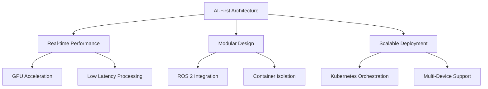
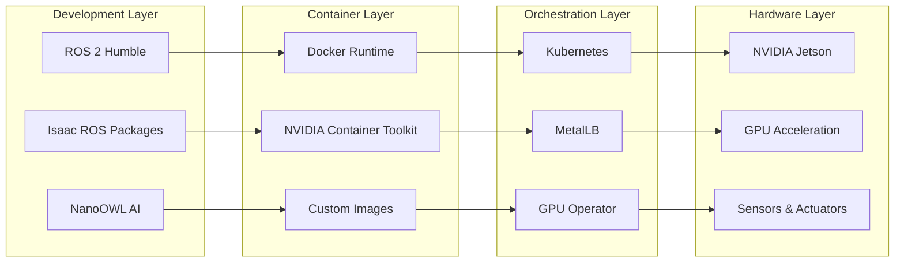

# 🚀 Isaac ROS Workspace Documentation

  <h2>Advanced AI-Driven Robotics Development Platform</h2>
  
<em>Empowering next-generation robotics with NVIDIA Isaac ROS on Jetson platforms</em>

---

## 🌟 Platform Overview

The **Isaac ROS Workspace** represents a cutting-edge development environment that seamlessly integrates NVIDIA's powerful Isaac ROS framework with modern containerization and orchestration technologies. This platform is specifically optimized for NVIDIA Jetson devices, enabling developers to build sophisticated AI-driven robotics applications with unprecedented performance and scalability.

### 🎯 Design Philosophy

---

## 🏗️ Core Architecture

-   :material-rocket-launch: **High-Performance Computing**
    
    ---
    
    Leverages NVIDIA Jetson's GPU acceleration for real-time AI inference and perception tasks
    
    **Key Benefits:**
    
    - Hardware-accelerated computer vision
    - Real-time sensor fusion
    - Optimized memory management

-   :material-docker: **Containerized Development**
    
    ---
    
    Docker-based isolation ensures consistent environments across development and production
    
    **Key Benefits:**
    
    - Environment consistency
    - Easy dependency management
    - Rapid deployment cycles

-   :material-kubernetes: **Orchestration Ready**
    
    ---
    
    Kubernetes integration enables scalable multi-device robotics deployments
    
    **Key Benefits:**
    
    - Multi-Jetson coordination
    - Load balancing
    - Fault tolerance

-   :material-robot: **ROS 2 Native**
    
    ---
    
    Built on ROS 2 Humble with Isaac ROS packages for advanced robotics capabilities
    
    **Key Benefits:**
    
    - Modern robotics middleware
    - Real-time communication
    - Extensive ecosystem

---

## 🛠️ Technology Stack

### Core Components

### Integration Flow

!!! info "Processing Pipeline"
    
    **Data Flow:** Sensors → Isaac ROS → AI Processing → Control Commands → Actuators
    
    **Advantages:**
    
    - **Low Latency:** Hardware-accelerated processing
    - **High Throughput:** Parallel GPU computation
    - **Reliability:** Container isolation and orchestration

---

## 🎯 Use Cases & Applications

-   :material-car: **Autonomous Vehicles**
    
    ---
    
    Advanced perception and navigation for autonomous driving systems
    
    - Real-time object detection
    - Path planning and control
    - Sensor fusion (LiDAR, Camera, IMU)

-   :material-factory: **Industrial Automation**
    
    ---
    
    Smart manufacturing and quality control applications
    
    - Robotic assembly lines
    - Visual inspection systems
    - Predictive maintenance

-   :material-home-assistant: **Service Robotics**
    
    ---
    
    Intelligent assistants and service robots for various environments
    
    - Navigation and mapping
    - Human-robot interaction
    - Task automation

-   :material-satellite-variant: **Research & Development**
    
    ---
    
    Academic and research applications in robotics and AI
    
    - Algorithm prototyping
    - Multi-robot systems
    - Edge AI research

---

## 🚀 Getting Started Journey

### 📋 Quick Navigation

=== "🏁 First Time Setup"

    Perfect for developers new to Isaac ROS or setting up a fresh environment.
    
    **Estimated Time:** 30-45 minutes
    
    **Prerequisites:** NVIDIA Jetson device, Ubuntu 20.04/22.04
    
    [Start Here →](getting-started.md){ .md-button .md-button--primary }

=== "🐳 Docker Deployment"

    Containerized development and production deployment guide.
    
    **Estimated Time:** 15-20 minutes
    
    **Prerequisites:** Docker installed, NVIDIA Container Toolkit
    
    [Deploy Now →](docker.md){ .md-button .md-button--primary }

=== "☸️ Kubernetes Scaling"

    Multi-device orchestration for production robotics systems.
    
    **Estimated Time:** 45-60 minutes
    
    **Prerequisites:** Kubernetes cluster, GPU nodes
    
    [Scale Up →](kubernetes.md){ .md-button .md-button--primary }

=== "🔧 Troubleshooting"

    Common issues and solutions for smooth operation.
    
    **When Needed:** Reference guide for problem resolution
    
    **Coverage:** Installation, runtime, and deployment issues
    
    [Get Help →](troubleshooting.md){ .md-button .md-button--primary }

---

## 📊 Performance Metrics

### Benchmark Results

!!! success "Performance Highlights"
    
    **Object Detection:** 30+ FPS on Jetson AGX Orin
    
    **SLAM Processing:** Real-time mapping with sub-centimeter accuracy
    
    **Multi-Device Latency:** <50ms communication between Jetson nodes
    
    **Container Overhead:** <5% performance impact with optimized images

### System Requirements

| Component | Minimum | Recommended |
|-----------|---------|-------------|
| **Platform** | Jetson Nano | Jetson AGX Orin |
| **Memory** | 4GB RAM | 32GB RAM |
| **Storage** | 32GB eMMC | 64GB NVMe SSD |
| **Network** | 100Mbps Ethernet | Gigabit Ethernet |
| **Sensors** | USB Camera | Stereo Camera + LiDAR |

---

## 🤝 Community & Support

### Resources

-   :material-github: **GitHub Repository**
    
    ---
    
    Source code, issues, and contributions
    
    [View on GitHub](https://github.com/TNG-Blue/Isaac_ROS_WS)

-   :material-book-open-variant: **Documentation**
    
    ---
    
    Comprehensive guides and API reference
    
    [Browse Docs](/)

-   :material-discord: **Community Chat**
    
    ---
    
    Real-time support and discussions
    
    [Join Discord](https://discord.gg/robotics)

-   :material-school: **Learning Resources**
    
    ---
    
    Tutorials, examples, and best practices
    
    [Start Learning](https://learn.nvidia.com/isaac)

---

## 🔄 Project Status

!!! tip "Current Version: v2.1.0"
    
    **Latest Features:**
    
    - Enhanced NanoOWL integration
    - Improved Kubernetes deployment templates
    - Updated Isaac ROS 2.1 compatibility
    - Performance optimizations for Jetson Orin

### Roadmap

- [x] **Q4 2024:** Isaac ROS 2.1 integration
- [x] **Q1 2025:** Kubernetes orchestration
- [ ] **Q2 2025:** Multi-modal perception
- [ ] **Q3 2025:** Edge-cloud hybrid deployment
- [ ] **Q4 2025:** Advanced AI model integration

---

  
<em>Built with ❤️ by the TNG-Blue team for the robotics community</em>

