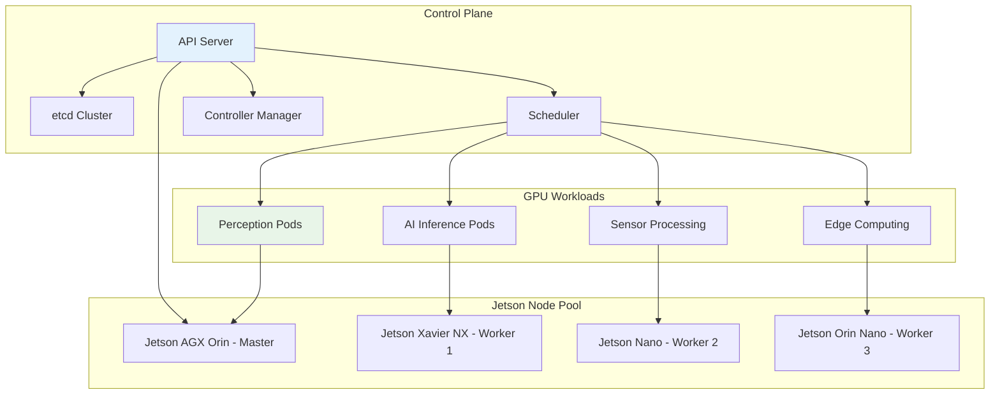
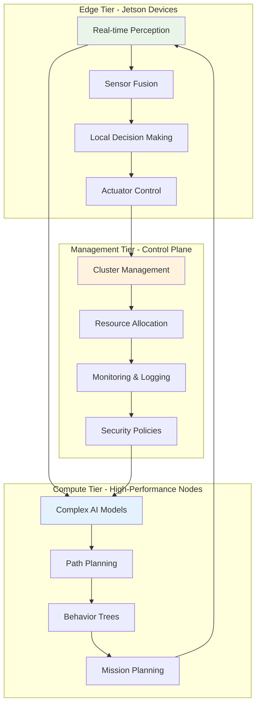
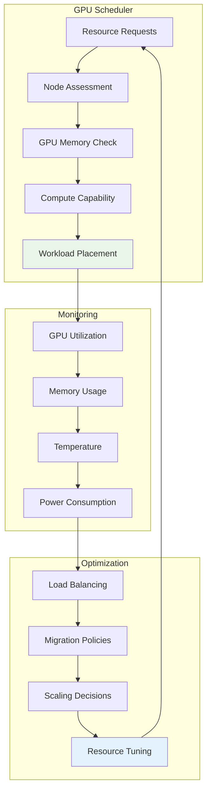
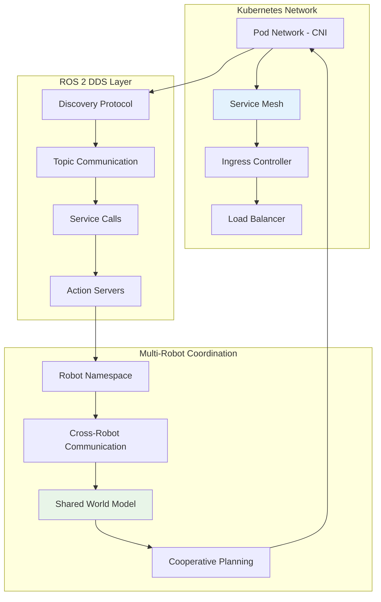
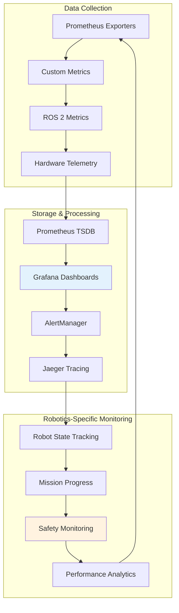
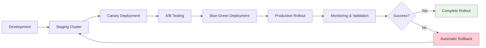
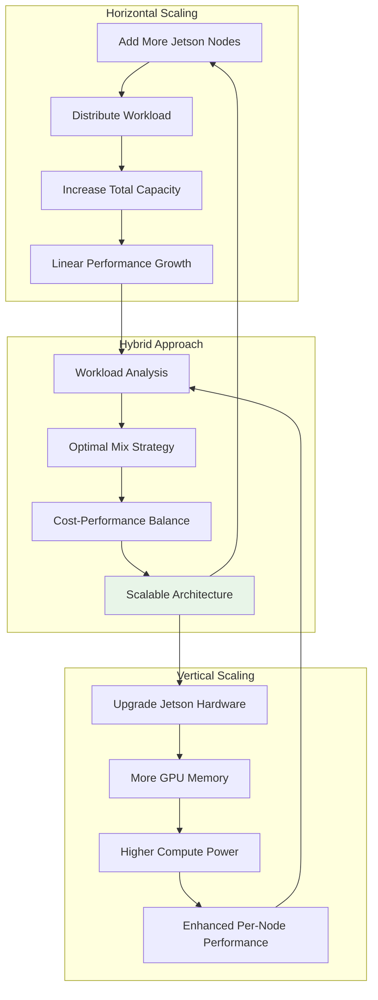
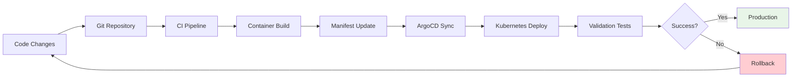

# ☸️ Kubernetes Orchestration

  <h2>Scalable Multi-Device Robotics with Kubernetes</h2>
  
<em>Enterprise-grade orchestration for distributed robotics systems</em>

---

## 🎯 Orchestration Overview

Kubernetes transforms Isaac ROS from single-device applications to enterprise-scale robotics platforms, enabling distributed computing across multiple NVIDIA Jetson devices with intelligent workload management and fault tolerance.

### 🏗️ Architecture Philosophy

### 🌟 Orchestration Benefits

-   :material-auto-fix: **Intelligent Scheduling**
    
    ---
    
    GPU-aware workload placement across heterogeneous Jetson devices
    
    **Features:**
    
    - Hardware capability matching
    - Resource requirement optimization
    - Affinity and anti-affinity rules
    - Real-time constraint handling

-   :material-shield-check: **High Availability**
    
    ---
    
    Fault-tolerant robotics systems with automatic recovery
    
    **Capabilities:**
    
    - Automatic pod restart
    - Node failure detection
    - Workload redistribution
    - Health monitoring

-   :material-scale-balance: **Dynamic Scaling**
    
    ---
    
    Adaptive resource allocation based on robotics workload demands
    
    **Benefits:**
    
    - Horizontal pod autoscaling
    - Vertical resource adjustment
    - Load-based distribution
    - Energy efficiency optimization

-   :material-network-outline: **Service Mesh**
    
    ---
    
    Secure and observable inter-service communication
    
    **Features:**
    
    - Service discovery
    - Load balancing
    - Traffic encryption
    - Distributed tracing

---

## 🛠️ Cluster Architecture

### Multi-Tier Deployment Model

### Node Classification & Roles

!!! info "Jetson Node Specialization"
    
    === "🚀 High-Performance Nodes"
    
        **Devices:** Jetson AGX Orin, Xavier AGX
        
        **Workloads:**
        
        - Complex AI inference (YOLO, Transformer models)
        - SLAM and mapping algorithms
        - Multi-modal sensor fusion
        - Behavior planning and decision making
        
        **Resource Profile:**
        
        - High GPU memory (16-64GB)
        - Multiple tensor cores
        - High-bandwidth storage
    
    === "⚡ Balanced Nodes"
    
        **Devices:** Jetson Xavier NX, Orin NX
        
        **Workloads:**
        
        - Real-time perception
        - Local path planning
        - Object tracking
        - Sensor preprocessing
        
        **Resource Profile:**
        
        - Moderate GPU memory (8-16GB)
        - Efficient power consumption
        - Good compute-to-power ratio
    
    === "🔧 Edge Nodes**
    
        **Devices:** Jetson Nano, Orin Nano
        
        **Workloads:**
        
        - Sensor data collection
        - Basic image processing
        - IoT gateway functions
        - Local caching
        
        **Resource Profile:**
        
        - Limited resources (4-8GB)
        - Ultra-low power consumption
        - Cost-effective deployment

---

## 🎛️ Resource Management

### GPU Resource Allocation

### Advanced Scheduling Strategies

-   :material-target: **Node Affinity**
    
    ---
    
    Direct workloads to optimal hardware configurations
    
    **Strategies:**
    
    - GPU memory requirements
    - Compute capability matching
    - Latency-sensitive placement
    - Co-location preferences

-   :material-timeline: **Temporal Scheduling**
    
    ---
    
    Time-aware workload distribution for real-time systems
    
    **Features:**
    
    - Priority-based scheduling
    - Deadline-aware allocation
    - Critical path optimization
    - Jitter minimization

-   :material-chart-gantt: **Resource Quotas**
    
    ---
    
    Guaranteed resource allocation for mission-critical functions
    
    **Controls:**
    
    - GPU memory reservations
    - CPU core guarantees
    - Network bandwidth limits
    - Storage IOPS allocation

-   :material-auto-awesome: **Dynamic Rebalancing**
    
    ---
    
    Continuous optimization of resource distribution
    
    **Mechanisms:**
    
    - Live migration
    - Workload redistribution
    - Predictive scaling
    - Performance feedback loops

---

## 🔗 Networking & Communication

### ROS 2 Network Architecture

### Service Discovery & Load Balancing

!!! success "Network Optimization"
    
    **ROS 2 + Kubernetes Integration:**
    
    - Native service discovery through Kubernetes DNS
    - Automatic load balancing for redundant nodes
    - Cross-namespace communication for multi-robot systems
    - Quality of Service (QoS) policy enforcement

### Advanced Networking Features

-   :material-security-network: **Network Policies**
    
    ---
    
    Secure communication between robotics components
    
    **Security Features:**
    
    - Micro-segmentation
    - Traffic encryption
    - Access control lists
    - Audit logging

-   :material-speedometer: **Traffic Management**
    
    ---
    
    Optimized data flow for real-time robotics
    
    **Optimizations:**
    
    - Priority queuing
    - Bandwidth management
    - Latency optimization
    - Multicast efficiency

-   :material-lan: **Multi-Cluster Networking**
    
    ---
    
    Connect distributed robotics deployments
    
    **Capabilities:**
    
    - Cross-cluster service mesh
    - Global load balancing
    - Disaster recovery
    - Geographic distribution

-   :material-wifi: **Edge-Cloud Hybrid**
    
    ---
    
    Seamless integration between edge and cloud resources
    
    **Features:**
    
    - Intelligent data routing
    - Bandwidth optimization
    - Offline operation
    - Cloud bursting

---

## 📊 Monitoring & Observability

### Comprehensive Monitoring Stack

### Key Performance Indicators

!!! tip "Robotics KPIs"
    
    **System Health:**
    
    - Pod restart frequency
    - Node availability percentage
    - GPU utilization efficiency
    - Network latency distribution
    
    **Application Performance:**
    
    - Perception processing time
    - Planning algorithm convergence
    - Control loop frequency
    - End-to-end mission success rate
    
    **Resource Optimization:**
    
    - Memory usage patterns
    - CPU scheduling effectiveness
    - Power consumption trends
    - Storage I/O performance

---

## 🛡️ Security & Compliance

### Multi-Layer Security Model

-   :material-shield: **Platform Security**
    
    ---
    
    Kubernetes cluster hardening and protection
    
    **Measures:**
    
    - RBAC policies
    - Pod security standards
    - Network segmentation
    - Secret management

-   :material-lock: **Application Security**
    
    ---
    
    Secure robotics application deployment
    
    **Controls:**
    
    - Container image scanning
    - Runtime security monitoring
    - Admission controllers
    - Security policy enforcement

-   :material-certificate: **Data Security**
    
    ---
    
    Protection of robotics data and communications
    
    **Features:**
    
    - Encryption at rest
    - TLS communication
    - Data classification
    - Privacy compliance

-   :material-account-check: **Access Control**
    
    ---
    
    Fine-grained access management
    
    **Capabilities:**
    
    - Multi-factor authentication
    - Service account management
    - Audit trail logging
    - Compliance reporting

### Compliance Considerations

!!! warning "Regulatory Compliance"
    
    **Industry Standards:**
    
    - ISO 26262 (Automotive)
    - IEC 61508 (Functional Safety)
    - GDPR (Data Protection)
    - HIPAA (Healthcare Robotics)
    
    **Implementation Support:**
    
    - Audit logging
    - Data lineage tracking
    - Security policy templates
    - Compliance dashboards

---

## 🚀 Deployment Patterns

### Progressive Rollout Strategy

### Multi-Environment Management

!!! info "Environment Strategy"
    
    === "🧪 Development Environment"
    
        **Purpose:** Feature development and testing
        
        **Characteristics:**
        
        - Single-node clusters
        - Relaxed security policies
        - Debug-enabled containers
        - Frequent deployments
    
    === "🔍 Staging Environment"
    
        **Purpose:** Integration testing and validation
        
        **Characteristics:**
        
        - Production-like configuration
        - Performance testing
        - Security validation
        - Automated testing pipelines
    
    === "🏭 Production Environment"
    
        **Purpose:** Live robotics operations
        
        **Characteristics:**
        
        - High availability setup
        - Strict security policies
        - Comprehensive monitoring
        - Disaster recovery

---

## 📈 Scaling Strategies

### Horizontal vs Vertical Scaling

### Auto-Scaling Configuration

-   :material-chart-line: **Horizontal Pod Autoscaler**
    
    ---
    
    Scale based on CPU, memory, and custom metrics
    
    **Metrics:**
    
    - Processing queue length
    - Response time targets
    - Resource utilization
    - Custom robotics KPIs

-   :material-resize: **Vertical Pod Autoscaler**
    
    ---
    
    Optimize resource requests and limits
    
    **Benefits:**
    
    - Right-size containers
    - Improve resource efficiency
    - Reduce waste
    - Enhance performance

-   :material-server: **Cluster Autoscaler**
    
    ---
    
    Add/remove nodes based on demand
    
    **Features:**
    
    - Cloud provider integration
    - Cost optimization
    - Capacity planning
    - Multi-zone support

-   :material-cog: **Custom Controllers**
    
    ---
    
    Robotics-specific scaling logic
    
    **Examples:**
    
    - Mission-based scaling
    - Time-of-day adjustments
    - Geographic distribution
    - Emergency response scaling

---

## 🔄 Operations & Maintenance

### GitOps Workflow

### Operational Excellence

!!! success "Best Practices"
    
    **Deployment Management:**
    
    - Infrastructure as Code (IaC)
    - Version-controlled configurations
    - Automated testing pipelines
    - Rollback procedures
    
    **Monitoring & Alerting:**
    
    - Proactive monitoring
    - Intelligent alerting
    - Root cause analysis
    - Performance optimization
    
    **Disaster Recovery:**
    
    - Regular backups
    - Multi-zone deployment
    - Failover procedures
    - Business continuity planning

---

  
<strong>🎉 Your enterprise-grade robotics platform is ready!</strong>

  
<em>Need help? Check our <a href="troubleshooting.md">Troubleshooting Guide</a></em>

