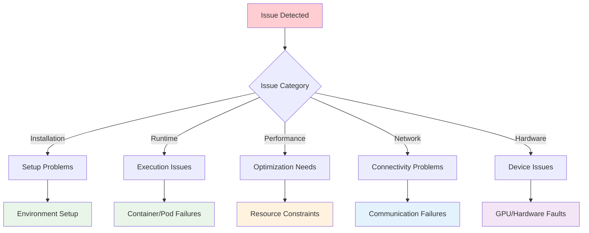
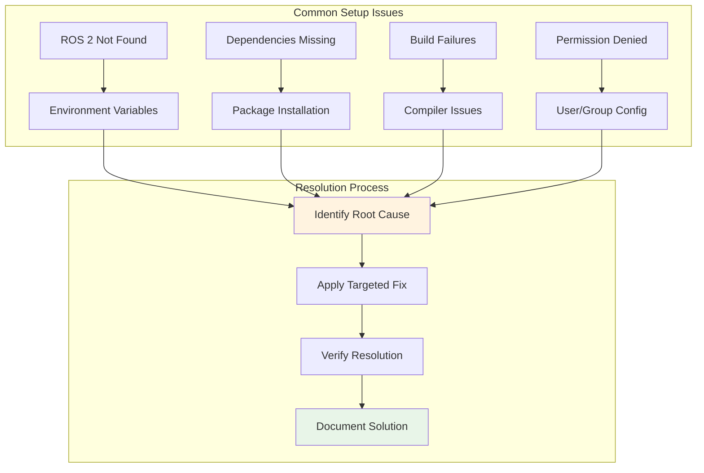
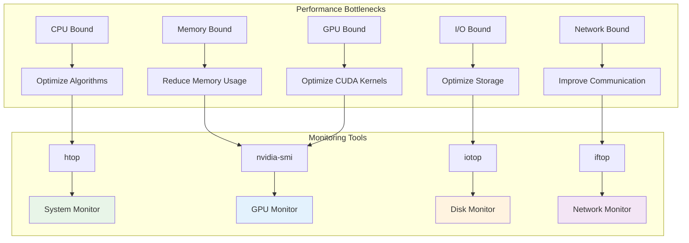
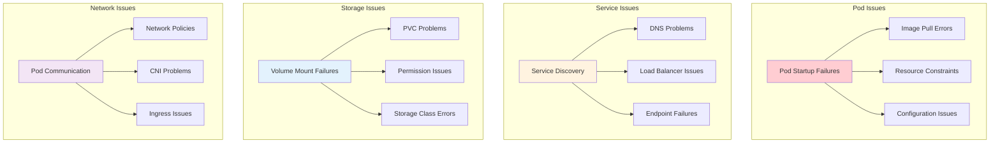
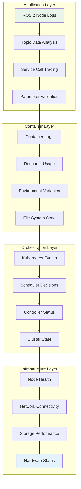

# 🔧 Troubleshooting Guide

<div align="center">
  <h2>Comprehensive Problem Resolution for Isaac ROS Workspace</h2>
  <p><em>Quick solutions and detailed diagnostics for common issues</em></p>
</div>

---

## 🎯 Diagnostic Overview

This guide provides systematic approaches to identify, diagnose, and resolve common issues encountered in Isaac ROS Workspace deployments across different environments and configurations.

### 🔍 Problem Classification



---

## 🚨 Critical Issues & Quick Fixes

### High-Priority Problems

!!! danger "Critical System Failures"
    
    **Immediate Action Required:**
    
    These issues can prevent system operation and require immediate attention.

<div class="grid cards" markdown>

-   :material-alert-circle: **GPU Not Detected**
    
    ---
    
    **Symptoms:** CUDA errors, no GPU acceleration, poor performance
    
    **Quick Check:**
    ```bash
    nvidia-smi  # Should show GPU info
    docker run --gpus all nvidia/cuda:11.8-base-ubuntu22.04 nvidia-smi
    ```
    
    **Common Causes:**
    
    - NVIDIA drivers not installed
    - nvidia-docker2 not configured
    - Insufficient permissions

-   :material-network-off: **ROS 2 Communication Failure**
    
    ---
    
    **Symptoms:** Nodes can't discover each other, no topic data
    
    **Quick Check:**
    ```bash
    ros2 node list  # Should show active nodes
    ros2 topic list  # Should show available topics
    ```
    
    **Common Causes:**
    
    - DDS configuration issues
    - Network firewall blocking
    - Incorrect environment sourcing

-   :material-memory: **Out of Memory Errors**
    
    ---
    
    **Symptoms:** Pods killed by OOMKiller, slow performance
    
    **Quick Check:**
    ```bash
    free -h  # Check available memory
    kubectl top pods  # Check pod memory usage
    ```
    
    **Common Causes:**
    
    - Insufficient memory allocation
    - Memory leaks in applications
    - Too many concurrent processes

-   :material-harddisk: **Storage Issues**
    
    ---
    
    **Symptoms:** Write failures, container startup issues
    
    **Quick Check:**
    ```bash
    df -h  # Check disk space
    docker system df  # Check Docker space usage
    ```
    
    **Common Causes:**
    
    - Disk space exhaustion
    - Permission problems
    - I/O performance bottlenecks

</div>

---

## 🔧 Installation & Setup Issues

### Environment Configuration Problems



### Step-by-Step Diagnostics

!!! info "Systematic Problem Solving"
    
    === "🔍 Environment Verification"
    
        **Check ROS 2 Installation:**
        
        1. Verify ROS 2 is properly installed
        2. Check environment sourcing
        3. Validate package discovery
        4. Test basic functionality
        
        **Diagnostic Commands:**
        ```bash
        # Check ROS 2 installation
        which ros2
        echo $ROS_DISTRO
        
        # Verify environment
        printenv | grep ROS
        
        # Test basic functionality
        ros2 run demo_nodes_cpp talker
        ```
    
    === "🐳 Docker Configuration"
    
        **Verify Docker Setup:**
        
        1. Check Docker service status
        2. Validate NVIDIA runtime
        3. Test GPU access
        4. Verify permissions
        
        **Diagnostic Commands:**
        ```bash
        # Check Docker status
        systemctl status docker
        
        # Test NVIDIA runtime
        docker run --rm --gpus all nvidia/cuda:11.8-base nvidia-smi
        
        # Check user permissions
        groups $USER | grep docker
        ```
    
    === "⚙️ Build System Issues"
    
        **Resolve Build Problems:**
        
        1. Check colcon installation
        2. Verify dependencies
        3. Clean build artifacts
        4. Rebuild with verbose output
        
        **Resolution Steps:**
        ```bash
        # Clean and rebuild
        rm -rf build/ install/ log/
        colcon build --symlink-install --cmake-args -DCMAKE_BUILD_TYPE=Release
        
        # Check specific package
        colcon build --packages-select <package_name> --verbose
        ```

### Common Error Patterns & Solutions

<div class="grid cards" markdown>

-   :material-bash: **Command Not Found**
    
    ---
    
    **Error Pattern:** `ros2: command not found`
    
    **Root Causes:**
    
    - ROS 2 not installed
    - Environment not sourced
    - Incorrect PATH configuration
    
    **Solutions:**
    
    - Install ROS 2 Humble
    - Source setup script: `source /opt/ros/humble/setup.bash`
    - Add to `.bashrc` for persistence

-   :material-package-variant: **Package Not Found**
    
    ---
    
    **Error Pattern:** `Package 'X' not found`
    
    **Root Causes:**
    
    - Missing dependencies
    - Workspace not built
    - Package path not sourced
    
    **Solutions:**
    
    - Run `rosdep install --from-paths src --ignore-src -r -y`
    - Build workspace: `colcon build`
    - Source workspace: `source install/setup.bash`

-   :material-key: **Permission Denied**
    
    ---
    
    **Error Pattern:** `Permission denied: '/dev/video0'`
    
    **Root Causes:**
    
    - User not in required groups
    - Incorrect device permissions
    - SELinux/AppArmor restrictions
    
    **Solutions:**
    
    - Add user to groups: `sudo usermod -aG video,dialout $USER`
    - Check device permissions
    - Configure security policies

-   :material-network-strength-1-alert: **Network Binding Failed**
    
    ---
    
    **Error Pattern:** `Failed to bind to address`
    
    **Root Causes:**
    
    - Port already in use
    - Network interface issues
    - Firewall blocking
    
    **Solutions:**
    
    - Check port usage: `netstat -tulpn | grep :11311`
    - Configure firewall rules
    - Use different network interface

</div>

---

## 🚀 Runtime & Performance Issues

### Performance Optimization Matrix



### System Resource Analysis

!!! tip "Performance Tuning Strategies"
    
    **CPU Optimization:**
    
    - Monitor CPU usage patterns
    - Optimize thread allocation
    - Use CPU affinity for critical tasks
    - Adjust process priorities
    
    **Memory Management:**
    
    - Monitor memory leaks
    - Optimize buffer sizes
    - Use memory pools
    - Configure swap appropriately
    
    **GPU Utilization:**
    
    - Profile CUDA kernels
    - Optimize memory transfers
    - Use unified memory where appropriate
    - Monitor GPU temperature and throttling

### Advanced Diagnostics

<div class="grid cards" markdown>

-   :material-chart-line: **Performance Profiling**
    
    ---
    
    **Tools & Techniques:**
    
    - `perf` for CPU profiling
    - `nsys` for GPU profiling
    - `valgrind` for memory analysis
    - `strace` for system call tracing
    
    **Usage Examples:**
    ```bash
    # CPU profiling
    perf record -g ros2 run my_package my_node
    perf report
    
    # GPU profiling
    nsys profile ros2 run isaac_ros_stereo_image_proc
    ```

-   :material-memory: **Memory Analysis**
    
    ---
    
    **Memory Debugging:**
    
    - Detect memory leaks
    - Analyze allocation patterns
    - Monitor heap usage
    - Check for memory fragmentation
    
    **Tools:**
    ```bash
    # Memory leak detection
    valgrind --leak-check=full ros2 run my_package my_node
    
    # Memory profiling
    massif-visualizer massif.out.*
    ```

-   :material-network-strength-4: **Network Diagnostics**
    
    ---
    
    **Network Performance:**
    
    - Monitor bandwidth usage
    - Analyze packet loss
    - Check latency patterns
    - Debug DDS communication
    
    **Diagnostic Commands:**
    ```bash
    # Network latency
    ping -c 10 target_host
    
    # Bandwidth testing
    iperf3 -c target_host
    
    # DDS monitoring
    ros2 run rqt_graph rqt_graph
    ```

-   :material-harddisk: **Storage Performance**
    
    ---
    
    **I/O Optimization:**
    
    - Monitor disk usage
    - Analyze I/O patterns
    - Optimize file system
    - Configure SSD properly
    
    **Performance Tests:**
    ```bash
    # Disk speed test
    dd if=/dev/zero of=testfile bs=1G count=1 oflag=direct
    
    # I/O monitoring
    iotop -o
    ```

</div>

---

## ☸️ Kubernetes-Specific Issues

### Container Orchestration Problems



### Kubernetes Debugging Workflow

!!! warning "Kubernetes Troubleshooting Steps"
    
    **1. Check Pod Status:**
    ```bash
    kubectl get pods -o wide
    kubectl describe pod <pod-name>
    kubectl logs <pod-name> --previous
    ```
    
    **2. Verify Resources:**
    ```bash
    kubectl top pods
    kubectl top nodes
    kubectl describe node <node-name>
    ```
    
    **3. Check Services:**
    ```bash
    kubectl get services
    kubectl describe service <service-name>
    kubectl get endpoints
    ```
    
    **4. Debug Networking:**
    ```bash
    kubectl exec -it <pod-name> -- nslookup kubernetes.default
    kubectl exec -it <pod-name> -- ping <other-pod-ip>
    ```

### Common Kubernetes Issues

<div class="grid cards" markdown>

-   :material-image-off: **ImagePullBackOff**
    
    ---
    
    **Symptoms:** Pods stuck in ImagePullBackOff state
    
    **Common Causes:**
    
    - Image doesn't exist
    - Registry authentication issues
    - Network connectivity problems
    - Image tag typos
    
    **Resolution:**
    
    - Verify image name and tag
    - Check registry credentials
    - Test network connectivity
    - Use `kubectl describe pod` for details

-   :material-cpu-64-bit: **Insufficient Resources**
    
    ---
    
    **Symptoms:** Pods in Pending state
    
    **Common Causes:**
    
    - Not enough CPU/memory
    - No suitable nodes
    - Resource quotas exceeded
    - Node affinity constraints
    
    **Resolution:**
    
    - Check resource requests/limits
    - Scale cluster if needed
    - Adjust resource quotas
    - Review scheduling constraints

-   :material-network-off: **Service Unreachable**
    
    ---
    
    **Symptoms:** Cannot connect to services
    
    **Common Causes:**
    
    - Service selector mismatch
    - Endpoint not ready
    - Network policy blocking
    - DNS resolution issues
    
    **Resolution:**
    
    - Verify service selectors
    - Check pod readiness probes
    - Review network policies
    - Test DNS resolution

-   :material-harddisk-remove: **Volume Mount Issues**
    
    ---
    
    **Symptoms:** Pods failing to start due to volume issues
    
    **Common Causes:**
    
    - PVC not bound
    - Storage class issues
    - Permission problems
    - Node storage full
    
    **Resolution:**
    
    - Check PVC status
    - Verify storage class
    - Fix file permissions
    - Free up node storage

</div>

---

## 🔬 Advanced Debugging Techniques

### Multi-Layer Debugging Approach



### Log Analysis & Correlation

!!! success "Effective Logging Strategy"
    
    **Log Aggregation:**
    
    - Centralized logging with ELK stack
    - Structured logging with JSON format
    - Correlation IDs for request tracing
    - Log level management
    
    **Analysis Tools:**
    
    - Kibana for log visualization
    - Grafana for metrics correlation
    - Jaeger for distributed tracing
    - Custom dashboards for robotics KPIs

---

## 📞 Getting Help & Support

### Support Channels

<div class="grid cards" markdown>

-   :material-github: **GitHub Issues**
    
    ---
    
    Report bugs and request features
    
    **Best Practices:**
    
    - Search existing issues first
    - Provide detailed reproduction steps
    - Include system information
    - Attach relevant logs
    
    [Open Issue](https://github.com/TNG-Blue/Isaac_ROS_WS/issues)

-   :material-discord: **Community Chat**
    
    ---
    
    Real-time support from community
    
    **Available Channels:**
    
    - General discussion
    - Technical support
    - Feature requests
    - Showcase projects
    
    [Join Discord](https://discord.gg/robotics)

-   :material-book-multiple: **Documentation**
    
    ---
    
    Comprehensive guides and references
    
    **Resources:**
    
    - Installation guides
    - API documentation
    - Tutorials and examples
    - Best practices
    
    [Browse Docs](/)

-   :material-school: **Learning Resources**
    
    ---
    
    Educational content and training
    
    **Content:**
    
    - Video tutorials
    - Hands-on workshops
    - Certification programs
    - Expert webinars
    
    [Start Learning](https://learn.nvidia.com/isaac)

</div>

### Bug Report Template

!!! info "Effective Bug Reporting"
    
    **Include the Following Information:**
    
    **Environment:**
    - Hardware platform (Jetson model, GPU, etc.)
    - Operating system version
    - ROS 2 distribution
    - Isaac ROS version
    - Container runtime version
    
    **Problem Description:**
    - Steps to reproduce
    - Expected behavior
    - Actual behavior
    - Error messages
    
    **Diagnostics:**
    - Relevant log files
    - System resource usage
    - Network configuration
    - Configuration files

---

## 📋 Maintenance & Prevention

### Proactive Maintenance Checklist

!!! tip "Regular Maintenance Tasks"
    
    **Daily:**
    - [ ] Monitor system resources
    - [ ] Check error logs
    - [ ] Validate critical services
    - [ ] Review performance metrics
    
    **Weekly:**
    - [ ] Clean up old containers/images
    - [ ] Update system packages
    - [ ] Check disk space usage
    - [ ] Review security alerts
    
    **Monthly:**
    - [ ] Update Isaac ROS packages
    - [ ] Review and update documentation
    - [ ] Performance optimization review
    - [ ] Backup critical configurations
    
    **Quarterly:**
    - [ ] Major version updates
    - [ ] Security audit
    - [ ] Disaster recovery testing
    - [ ] Hardware health check

### Prevention Strategies

<div class="grid cards" markdown>

-   :material-monitor: **Monitoring**
    
    ---
    
    **Proactive Monitoring Setup:**
    
    - Set up alerting thresholds
    - Monitor key performance indicators
    - Track resource utilization trends
    - Implement health checks

-   :material-backup-restore: **Backup & Recovery**
    
    ---
    
    **Data Protection:**
    
    - Regular configuration backups
    - Database snapshots
    - Container image versioning
    - Disaster recovery procedures

-   :material-security: **Security**
    
    ---
    
    **Security Hardening:**
    
    - Regular security updates
    - Access control reviews
    - Network security policies
    - Vulnerability assessments

-   :material-cog-outline: **Automation**
    
    ---
    
    **Automated Operations:**
    
    - CI/CD pipelines
    - Automated testing
    - Self-healing systems
    - Scaling automation

</div>

---

<div align="center">
  <p><strong>🎯 Problem solved? Help improve this guide!</strong></p>
  <p><em>Share your solutions and help the community grow stronger</em></p>
</div>